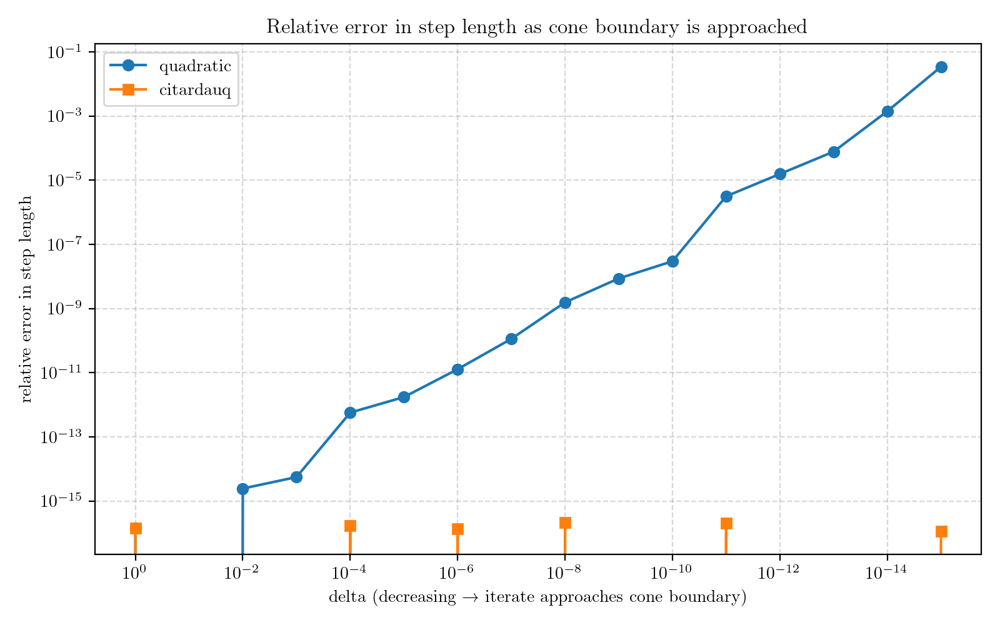

# Robust Quadratic Formula

In [QOCO](https://github.com/qoco-org/qoco), [a quadratic equation must be solved](https://qoco-org.github.io/qoco/contributing/developer_guide.html#cone-implementation) to compute the exact step-length needed to stay within a second-order cone.

Traditionally, the quadratic formula is used, but as the iterate approaches the boundary of the cone (which occurs as the optimal solution is approached), the quadratic formula will incur **catastrophic cancellation** in the numerator, since two nearly equal floating point numbers are subtracted from each other.

The [citardauq formula](https://en.wikipedia.org/wiki/Quadratic_formula#Square_root_in_the_denominator) avoids this catastrophic cancellation. This repository contains an implementation of both formulas and a test case which mimics the iterate of QOCO approaching the cone boundary. It can be seen that the quadratic formula incurs a large error as the boundary is approached, but the citardauq formula does not.

  

